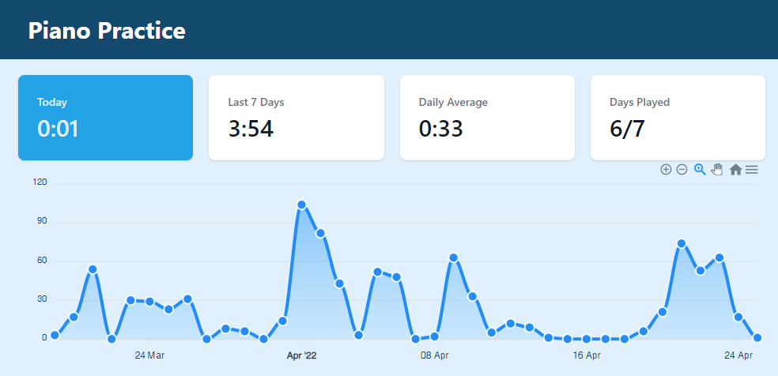

# Raspberry Pi Practice Tracker

Become a better musician by tracking your practice sessions. Because what gets measured gets managed.

## What's This?

This small piece of software can be installed on a Raspberry Pi or similar device.  
After completing the setup you can plug in your MIDI device and forget about it.   
Your practice sessions will automatically be tracked.



## Setup

### Requirements

You will need a Raspberry Pi or similar, as well as an instrument with MIDI output and a cable to connect these two.

Dependencies:

* python >= 3.9
* pipenv

### Installation

We will use `/home/pi/code/practicetracker` as our installation directory. If you use another directory please change
the paths in the files in the `/service` directory accordingly.

Change the current directory to `/home/pi/code` to get started:

```
$ mkdir -p /home/pi/code/  # Create the directory if it doesn't exist
$ cd /home/pi/code/
```

Clone this repository and change into the directory

```
$ git clone https://github.com/FelixAuer/practicetracker
$ cd practicetracker
```

### Install pipenv and needed packages

```
$ sudo apt install pipenv
$ sudo apt-get install libatlas-base-dev
$ sudo apt install sqlite3
```

### Install modules

```
$ pipenv install
```

If you're having troubles with `pip install` try `pip install --skip-lock`.

### Configure Input

Plug your Raspi into your MIDI keyboard and turn both things on. Run the following command to get the correct input
port:
```
pipenv run python test.py
```
The output should look like this:
```
$ pipenv run python test.py
Loading .env environment variables...
 0: interface :b'ALSA':, name :b'Midi Through Port-0':, opened :0:  (output)
 1: interface :b'ALSA':, name :b'Midi Through Port-0':, opened :0:  (input)
 2: interface :b'ALSA':, name :b'USB-MIDI MIDI 1':, opened :0:  (output)
 3: interface :b'ALSA':, name :b'USB-MIDI MIDI 1':, opened :0:  (input) <------ That's the right one
```
Rename `.env.example` to `.env` and set the value of `PIANO_PORT` to the correct input number. (3 for this example).

### Create sqlite database
```
$ touch practicetracker.db 
```

### Activate services
Copy the service files to their location:
```
$ cp service/practicetracker.service ~/.config/systemd/user/practicetracker.service
$ cp service/practicetracker_dashboard.service ~/.config/systemd/user/practicetracker_dashboard.service
```
Finally set them up:
```
$ systemctl --user daemon-reload
$ systemctl --user start practicetracker
$ systemctl --user enable practicetracker
$ systemctl --user enable practicetracker_dashboard
$ systemctl --user enable practicetracker_dashboard
```
### Connect to fryderyk.xyz
Retrieve your auth token from fryderyk.xyz and put into your `.env` file as `FRYDERYK_AUTH_TOKEN`

Add the following entry to your crontab:
```
*/5 * * * * cd /home/pi/code/practicetracker && /usr/local/bin/pipenv run python sync.py >/dev/null 2>&1
```
